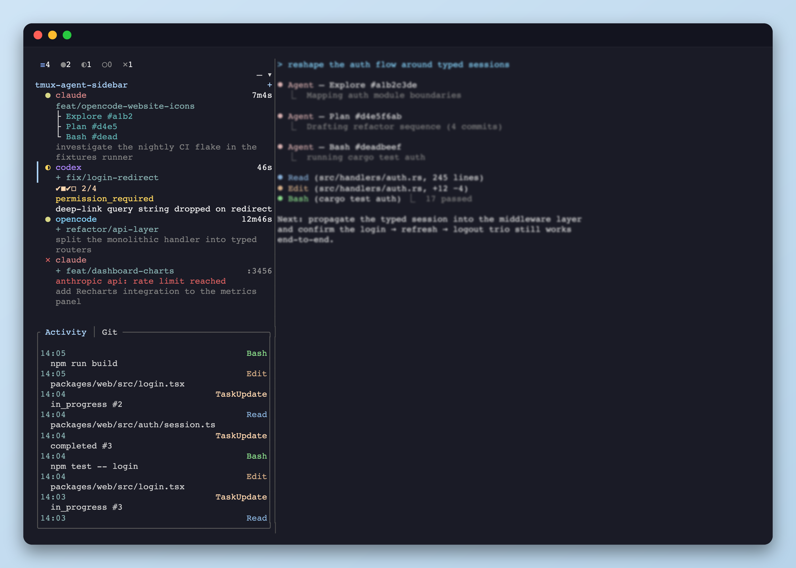

<h1 align="center">tmux-agent-sidebar</h1>

<p align="center">One tmux sidebar that tracks every Claude Code, Codex, and OpenCode pane across every session and window. See status, prompts, Git state, activity, and worktrees without switching windows.</p>

<p align="center"></p>

<p align="center">
  <a href="https://hiroppy.github.io/tmux-agent-sidebar/">Documentation</a> ·
  <a href="https://hiroppy.github.io/tmux-agent-sidebar/getting-started/installation/">Getting Started</a> ·
  <a href="https://hiroppy.github.io/tmux-agent-sidebar/features/agent-pane/">Features</a>
</p>

## Features

- **Every pane, one view** 
  — tracks Claude Code, Codex, and OpenCode panes across all tmux sessions and windows
- **Live metadata** 
  — prompts, tool calls, response previews, wait reasons, task progress, and subagent trees refresh as the agents work
- **Worktrees, included** 
  — spawn a fresh worktree + agent from the sidebar and tear it down — window, worktree, and branch — in one keystroke
- **Desktop notifications** 
  — native alerts when an agent finishes, needs permission, or errors out

OpenCode uses a small local plugin bridge instead of per-event hook config. The plugin lives at `.opencode/plugins/tmux-agent-sidebar.js` and can be symlinked as a single file into `~/.config/opencode/plugins/` so it coexists with any existing plugins.

## Requirements

- tmux 3.0+
- [TPM](https://github.com/tmux-plugins/tpm) (or the manual install in [Installation](https://hiroppy.github.io/tmux-agent-sidebar/getting-started/installation/))
- [GitHub CLI](https://cli.github.com/) (optional — required only for PR numbers in the Git tab)

## Quick Start

### 1. Install the plugin

Using [TPM](https://github.com/tmux-plugins/tpm):

```tmux
set -g @plugin 'hiroppy/tmux-agent-sidebar'
```

Reload tmux (`tmux source ~/.tmux.conf`), then press `prefix + I`. The install wizard downloads a pre-built binary or builds from source.

### 2. Wire up the agent hooks

- **Claude Code** — register the plugin inside Claude Code:

  ```sh
  /plugin marketplace add ~/.tmux/plugins/tmux-agent-sidebar
  /plugin install tmux-agent-sidebar@hiroppy
  ```

- **Codex** — open a Codex pane, press `prefix + e`, click the yellow `ⓘ` badge, copy the setup snippet, paste it into the Codex pane.
- **OpenCode** — symlink just the plugin file so your existing `~/.config/opencode/plugins/` contents stay untouched:

  ```sh
  mkdir -p ~/.config/opencode/plugins
  ln -sf ~/.tmux/plugins/tmux-agent-sidebar/.opencode/plugins/tmux-agent-sidebar.js \
    ~/.config/opencode/plugins/tmux-agent-sidebar.js
  ```

Full walkthroughs: [Claude Code setup](https://hiroppy.github.io/tmux-agent-sidebar/getting-started/claude-code/) · [Codex setup](https://hiroppy.github.io/tmux-agent-sidebar/getting-started/codex/) · [OpenCode setup](https://hiroppy.github.io/tmux-agent-sidebar/getting-started/opencode/)

### 3. Toggle the sidebar

`prefix + e` toggles the sidebar in the current window, `prefix + E` toggles it everywhere.

## Documentation

The [documentation site](https://hiroppy.github.io/tmux-agent-sidebar/) covers every feature and option:

- [Agent pane breakdown](https://hiroppy.github.io/tmux-agent-sidebar/features/agent-pane/)
- [Worktree lifecycle](https://hiroppy.github.io/tmux-agent-sidebar/features/worktree/)
- [Activity log](https://hiroppy.github.io/tmux-agent-sidebar/features/activity-log/) · [Git tab](https://hiroppy.github.io/tmux-agent-sidebar/features/git-status/) · [Notifications](https://hiroppy.github.io/tmux-agent-sidebar/features/notifications/)
- [Agent support matrix](https://hiroppy.github.io/tmux-agent-sidebar/agents/)
- [Keybindings](https://hiroppy.github.io/tmux-agent-sidebar/reference/keybindings/) · [tmux options](https://hiroppy.github.io/tmux-agent-sidebar/reference/tmux-options/) · [Scripting](https://hiroppy.github.io/tmux-agent-sidebar/reference/scripting/)

## Development

Symlink the plugin directory to your working copy so builds are picked up without copying:

```sh
rm -rf ~/.tmux/plugins/tmux-agent-sidebar
ln -s <path-to-this-repo> ~/.tmux/plugins/tmux-agent-sidebar
cargo build --release
```

Toggle the sidebar off → on to pick up the new binary.

## License

[MIT](./LICENSE)
