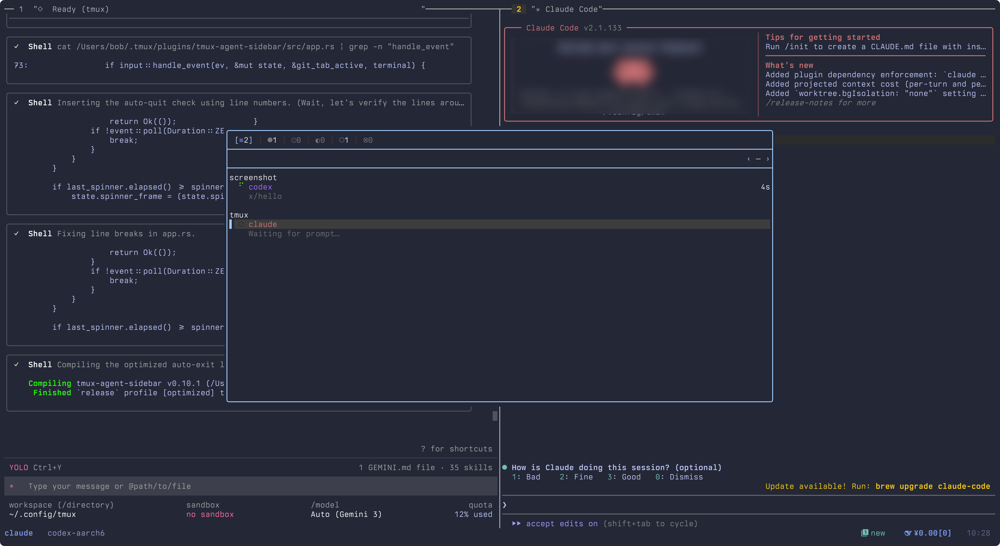

<h1 align="center">tmux-agent-sidebar</h1>

<p align="center">
  
</p>

---

## 🚀 简洁的 tmux 浮窗 Agent 面板

一个简洁的 tmux 浮窗面板，用于实时监控所有 Agent 的运行状态，并支持快速跳转到对应的 pane。该面板也可作为独立的 TUI 应用在终端中直接运行。

<p align="center">
  
</p>

- **状态监控** — 汇总显示所有会话中的 Agent 状态、提示词及任务进度。
- **快速跳转** — 在面板中直接选中并跳转到目标 Agent 所在的窗口或面板。
- **Git & Worktrees** — 在 TUI 中直接管理工作树并查看 Git 状态。

---

## 🔔 tmux window 状态提醒

集成 tmux window bell 机制。当 Agent 需要确认或任务完成时，tmux 状态栏会显示提醒标识，聚焦到对应面板后自动消除。

<p align="center">
  
</p>

---

## 🛠️ Usage

Bind a key to toggle the floating TUI in your `tmux.conf`:

```tmux
# Toggle floating sidebar (90% width/height)
bind e display-popup -EE -w 90% -h 90% "tmux-agent-sidebar"
```

---

## 📦 Installation & Setup

This repository is a fork with UI improvements. For detailed installation instructions, setup wizards, and agent hook configuration, please refer to the **[upstream repository](https://github.com/hiroppy/tmux-agent-sidebar)**.

---

## License

[MIT](./LICENSE)
